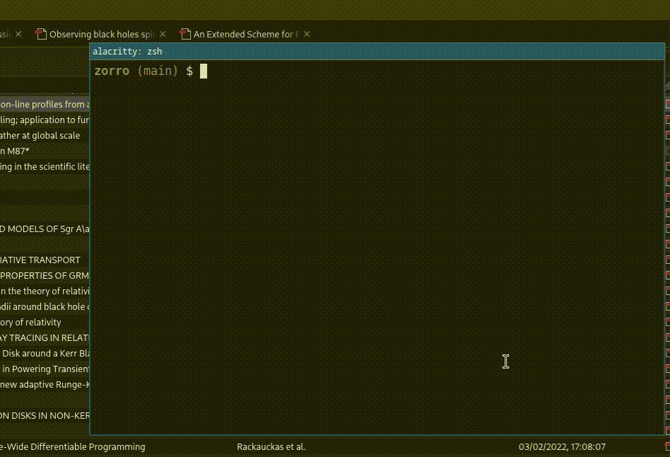

# zorro

<div align="center">
    
    <p align="center">
    <i>Your clunky CLI for zeroing in on search results in Zotero</i>
    </p>
</div>

Zorro is a command line tool for more expressively and interactively searching through the Zotero library.

## Installation

Grab a binary from the [releases]() for your OS.

### Building from source

Using the Zig master version, clone and `cd` and then:

```bash
zig build --release=safe
```

The binary will then be in `./zig-out/bin/zorro`.

To build statically (for distribution), specify the target with `musl` to avoid linking the system LibC:
```bash
zig build --release=safe -Dtarget=x86_64-linux-musl
```


## Features and planned features

The order below is arbitary:

- [x] A small interactive TUI for selecting and viewing the search results
- [x] Search author, scoring the author position (first author scores higher than second, etc.)
- [x] Search year including ranges (before, after, inbetween)
- [ ] Fuzzy searching in titles
- [ ] Fuzzy searching in abstracts
- [x] Zotero interaction: open or select items from the CLI directly in Zotero
- [ ] Sort based on tags / visualise tags. I use a `read` and `todo` tag to track what I've read and what I need to look at, and I want visual feedback for those.
- [ ] Search in and export highlights and notes.
- [ ] Open current browser with search engine of choice. My plan here to to take advantage of the search features that e.g. NASA's ADS library have, so that if I don't have something in Zotero, I can easily go find it using the same search query.

## Usage

```
zoro help
```
